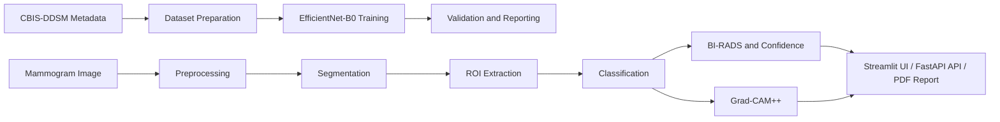

# Breast Cancer AI

[](https://www.python.org/)
[](https://pytorch.org/)
[](https://streamlit.io/)
[](https://fastapi.tiangolo.com/)
[](#license)

## Project Title

Breast Cancer AI is an explainable machine learning system for mammogram analysis. It combines preprocessing, lesion segmentation, binary classification, BI-RADS-style assessment, uncertainty estimation, Grad-CAM visualization, and report generation in a single workflow.

## Project Status

This repository is a completed research prototype with a finalized EfficientNet-B0 classifier.

Current best validation metrics:

- ROC-AUC: 0.7985
- Accuracy: 71.43%

The surrounding Streamlit app, FastAPI service, preprocessing utilities, and reporting tools are organized to support local inference and presentation.

## Project Overview

This repository provides a research-oriented pipeline for working with mammography images and CBIS-DDSM-style annotations. The project supports local inference through both a Streamlit web interface and a FastAPI API, and it includes training and evaluation scripts for an EfficientNet-B0 classifier.

The system is intended for experimentation, education, and research. It is not intended for clinical diagnosis.

## Key Features

- End-to-end mammogram inference pipeline
- Tumor region segmentation support
- Benign vs. malignant classification
- BI-RADS-inspired confidence scoring
- Grad-CAM++ explainability visualizations
- PDF report generation
- Streamlit UI and FastAPI API
- Docker-based deployment support

## Pipeline Overview



## Dataset (CBIS-DDSM)

The project is designed around CBIS-DDSM-style mammography data and uses CSV annotation files with image paths and labels. The repository includes sample assets under the following folders:

- [datasets/annotations](datasets/annotations)
- [mock_cbis](mock_cbis)
- [datasets/raw](datasets/raw)
- [datasets/processed](datasets/processed)

For full training, the expected data format is a CSV file containing image paths and labels for train/validation splits.

## Model Architecture (EfficientNet-B0)

The classification component is based on EfficientNet-B0, using a pretrained ImageNet backbone and a binary classification head for benign vs. malignant prediction. The classifier has been finalized and is treated as the main completed model for this project.

Key implementation details:

- Backbone: EfficientNet-B0
- Task: binary classification
- Optimizer: AdamW
- Loss: focal loss
- Training script: [train_efficientnet_b0.py](train_efficientnet_b0.py)
- Evaluation script: [evaluate_efficientnet_b0.py](evaluate_efficientnet_b0.py)

## Folder Structure

```text
breast-cancer-ai/
├── app.py
├── config.py
├── requirements.txt
├── setup.py
├── Dockerfile
├── docker-compose.yml
├── api/
├── services/
├── pipelines/
├── utils/
├── models/
├── datasets/
├── mock_cbis/
├── notebooks/
├── outputs/
├── reports/
└── tmp_output/
```

## Installation

### Prerequisites

- Python 3.10+
- pip
- Optional: NVIDIA GPU for faster training/inference

### Setup

On Windows PowerShell:

```powershell
python -m venv .venv
.venv\Scripts\Activate.ps1
pip install -r requirements.txt
```

### Validate the environment

```powershell
python setup.py check
```

## Training

Training is implemented in [train_efficientnet_b0.py](train_efficientnet_b0.py).

Example:

```powershell
python train_efficientnet_b0.py --train-csv datasets/annotations/train.csv --val-csv datasets/annotations/val.csv --batch-size 16 --epochs 15
```

This will save checkpoints and the best model under [models](models).

## Evaluation

Evaluation is implemented in [evaluate_efficientnet_b0.py](evaluate_efficientnet_b0.py).

Example:

```powershell
python evaluate_efficientnet_b0.py --checkpoint models/effnet_best.pth --val-csv datasets/annotations/val.csv
```

The repository currently includes an evaluation report at [reports/evaluation_report.txt](reports/evaluation_report.txt).

## Inference

### Streamlit UI

```powershell
streamlit run app.py
```

Open the local URL shown by Streamlit and upload a mammogram image to run the analysis.

### API Server

```powershell
python setup.py serve
```

Or directly:

```powershell
uvicorn api.main:app --host 127.0.0.1 --port 8000
```

## API Usage

Health check:

```bash
curl http://127.0.0.1:8000/health
```

Prediction request:

```bash
curl -X POST http://127.0.0.1:8000/predict \
  -F "file=@mammogram.png" \
  -F "patient_id=Demo Patient" \
  -F "generate_report=true"
```

## Grad-CAM Visualization

The project includes explainability support through Grad-CAM++. Heatmaps are generated during inference and can be viewed in the Streamlit interface or saved to the output directories such as [outputs/heatmaps](outputs/heatmaps).

## Results

The finalized validation snapshot for the EfficientNet-B0 classifier is:

- Accuracy: 71.43%
- ROC-AUC: 0.7985

The project remains a research prototype rather than a clinical decision system. Outputs are intended for education, experimentation, and demonstration.

## Technologies Used

- Python
- PyTorch
- TorchVision
- timm
- OpenCV
- Pillow
- scikit-learn
- FastAPI
- Streamlit
- ReportLab
- TensorBoard

## Future Improvements

- Expand dataset support and improve validation coverage
- Add more robust training pipelines and experiment tracking
- Improve model calibration and uncertainty estimation
- Add additional evaluation metrics and clinical-focused benchmarking
- Strengthen deployment and test coverage

## Practical Notes

- Streamlit is the most complete end-user experience in the repository.
- The FastAPI service is useful for automation and integration tests.
- Generated reports, heatmaps, and outputs are written to the folders under [outputs](outputs) and [reports](reports).

## License

This repository does not currently include a dedicated license file. For now, it is intended for research and educational use only. A formal license should be added before broader redistribution or commercial use.

## Acknowledgements

- CBIS-DDSM dataset and related mammography research community
- PyTorch and the wider open-source machine learning ecosystem
- The contributors and maintainers of the libraries used in this project
